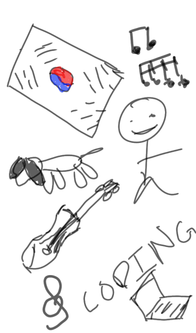

<!-- ## Overview of Hacks, Study and Tangibles
Blogging in GitHub pages is a way to learn and code at the same time. 

- Plans, Lists, [Scrum Boards](https://clickup.com/blog/scrum-board/) help you to track key events, show progress and record time.  Effort is a big part of your class grade.  Show plans and time spent!
- [Hacks(Todo)](https://levelup.gitconnected.com/six-ultimate-daily-hacks-for-every-programmer-60f5f10feae) enable you to stay in focus with key requirements of the class.  Each Hack will produce Tangibles.
- Tangibles or [Tangible Artifacts](https://en.wikipedia.org/wiki/Artifact_(software_development)) are things you accumulate as a learner and coder.  -->

<!-- ## MY PAGE -->

<button class="button_above" onclick="window.location.href='https://nighthawkcoders.github.io/teacher/csp';">Schedule</button>
<button class="button_above" onclick="window.location.href='https://poway.instructure.com/courses/141645';">Canvas</button>
<button class="button_above" onclick="window.location.href='https://app.slack.com/client/TUDAF53UJ/CUU064ACX';">Slack</button>

<h2>About Me:</h2>

    
    <ol style="font-size:15px">
        <li>I was born in South Korea</li>
         
        <li>I have a dog   </li>
         
        <li>I like music</li>
         
        <li>I play the violin</li>
         
        <li>I enjoy coding </li>
    </ol>

   
<button class="note_button" onclick="createItem()">Create a note</button>
<h1>Notepad</h1>
<ol id="note">
</ol>

<html>
    <head>
        <!-- <link rel="stylesheet" href="theme.css"> -->
        
    </head>
    <body>
        
    </body>
</html>

