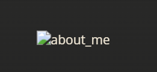
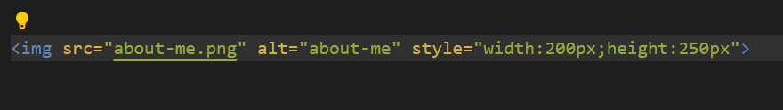
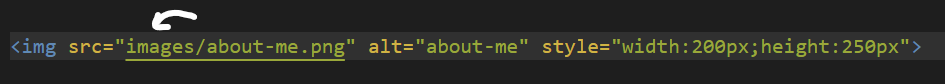

<h1>Unit 1: Build a Lab Notebook</h1>
<table>
    <tr>
        <th>Week</th>
        <th>Plan</th>
        <th>Hacks (IPYNB)</th>
        <th>Tangibles</th>
    </tr>
    <tr>
        <td>0</td>
        <td><a>Add wsl, github, and vscode</a></td>
        <td></td>
        <td><a href="{{site.baseurl}}/games">Games & Projects</a></td>
    </tr>
    <tr>
        <td>1</td>
        <td></td>
        <td></td>
        <td></td>
    </tr>
    <tr>
        <td>2</td>
        <td></td>
        <td></td>
        <td></td>
    </tr>
    <tr>
        <td>3</td>
        <td></td>
        <td></td>
        <td></td>
    </tr>
</table>
    
<h1>Fixed Errors</h1>
<ul>
    <li style="font-size:15px">
        Image wasn't rendering in: 
         
          
        Fix:  
        <h4>Fixed the directory</h4>
        
    </li>
     
    <li>
        Make isn't working 
        Fix: 
        <h4>Comment out line 7 in file 'Makefile'</h4>
    </li>
     
    <li>Custom Theme isn't saving on local server
         
        Fix:
        <h4>Make new local server to save changes</h4>
    </li>
</ul>
<h1>Ongoing Errors</h1>
<ul>
</ul>

<!-- 
<h1>To-do</h1>
<html>
    <head>
    </head>
    <body>
        
    </body>
</html> -->
